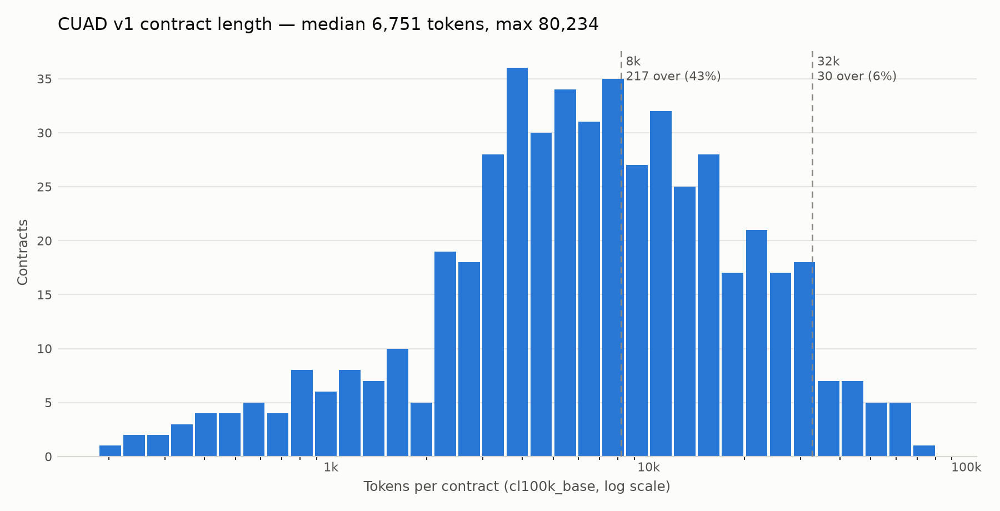

# CUAD v1 data audit

Generated by [`scripts/audit_data.py`](../scripts/audit_data.py) - the pre-flight
profiling pass required by [`CLAUDE.md`](../CLAUDE.md) section 2.2, run before any
application code. Reproduce with:

```bash
uv run python scripts/audit_data.py --seed 42 --full-offset-scan
```

**Corpus:** 510 contracts, 13,823 annotated spans, 41 clause categories.
Contracts are read from `data/raw/CUAD_v1/full_contract_txt/` as UTF-8.

## Verdict up front

| Check | Result | Design impact |
|---|---|---|
| 1. Per-clause positives | 33 of 41 categories clear the >=40 bar | 8 categories excluded as unmeasurable |
| 2. Base rate | 2.5% to 100.0% | High-prevalence clauses need span-level metrics, not presence F1 |
| 3. Token length | median 6,751, p99 57,507, max 80,234 | Cost-curve story, not an accuracy-cliff story |
| 4. Offset integrity | **13823/13823 exact (100.00%)** | Offsets usable as-is, but only against raw text |
| 5. Multi-span | 61% of positive pairs are single-span | Metric defined as any-span-hit; see below |

---

## Checks 1 and 2 — positive counts and base rates

| # | Clause category | Positive contracts | Base rate | Gold spans | CSV label | Agrees | Status |
|---|---|---|---|---|---|---|---|
| 1 | Document Name | 510 | 100.0% | 521 | value (510) | n/a | included |
| 2 | Parties | 509 | 99.8% | 2,554 | value (509) | n/a | included |
| 3 | Agreement Date | 470 | 92.2% | 476 | value (465) | n/a | included |
| 4 | Governing Law | 437 | 85.7% | 464 | value (434) | n/a | included |
| 5 | Expiration Date | 413 | 81.0% | 467 | value (329) | n/a | included |
| 6 | Effective Date | 390 | 76.5% | 447 | value (359) | n/a | included |
| 7 | Anti-Assignment | 374 | 73.3% | 654 | Yes/No (374 yes) | yes | included |
| 8 | Cap On Liability | 275 | 53.9% | 672 | Yes/No (275 yes) | yes | included |
| 9 | License Grant | 255 | 50.0% | 777 | Yes/No (255 yes) | yes | included |
| 10 | Audit Rights | 214 | 42.0% | 643 | Yes/No (214 yes) | yes | included |
| 11 | Termination For Convenience | 183 | 35.9% | 246 | Yes/No (183 yes) | yes | included |
| 12 | Post-Termination Services | 182 | 35.7% | 450 | Yes/No (182 yes) | yes | included |
| 13 | Exclusivity | 180 | 35.3% | 410 | Yes/No (180 yes) | yes | included |
| 14 | Renewal Term | 176 | 34.5% | 210 | value (163) | n/a | included |
| 15 | Insurance | 166 | 32.5% | 560 | Yes/No (167 yes) | **NO** | included |
| 16 | Revenue/Profit Sharing | 166 | 32.5% | 418 | Yes/No (166 yes) | yes | included |
| 17 | Minimum Commitment | 165 | 32.4% | 424 | Yes/No (165 yes) | yes | included |
| 18 | Non-Transferable License | 138 | 27.1% | 298 | Yes/No (138 yes) | yes | included |
| 19 | Ip Ownership Assignment | 124 | 24.3% | 318 | Yes/No (124 yes) | yes | included |
| 20 | Change Of Control | 121 | 23.7% | 253 | Yes/No (121 yes) | yes | included |
| 21 | Non-Compete | 119 | 23.3% | 259 | Yes/No (119 yes) | yes | included |
| 22 | Notice Period To Terminate Renewal | 111 | 21.8% | 122 | value (101) | n/a | included |
| 23 | Uncapped Liability | 111 | 21.8% | 167 | Yes/No (111 yes) | yes | included |
| 24 | Covenant Not To Sue | 100 | 19.6% | 173 | Yes/No (100 yes) | yes | included |
| 25 | Rofr/Rofo/Rofn | 85 | 16.7% | 367 | Yes/No (85 yes) | yes | included |
| 26 | Volume Restriction | 82 | 16.1% | 171 | Yes/No (82 yes) | yes | included |
| 27 | Competitive Restriction Exception | 76 | 14.9% | 125 | Yes/No (76 yes) | yes | included |
| 28 | Warranty Duration | 75 | 14.7% | 176 | Yes/No (75 yes) | yes | included |
| 29 | Irrevocable Or Perpetual License | 70 | 13.7% | 165 | Yes/No (70 yes) | yes | included |
| 30 | Liquidated Damages | 61 | 12.0% | 121 | Yes/No (61 yes) | yes | included |
| 31 | Affiliate License-Licensee | 59 | 11.6% | 115 | Yes/No (59 yes) | yes | included |
| 32 | No-Solicit Of Employees | 59 | 11.6% | 91 | Yes/No (59 yes) | yes | included |
| 33 | Joint Ip Ownership | 46 | 9.0% | 115 | Yes/No (46 yes) | yes | included |
| 34 | Non-Disparagement | 38 | 7.5% | 65 | Yes/No (38 yes) | yes | **EXCLUDED** |
| 35 | No-Solicit Of Customers | 34 | 6.7% | 58 | Yes/No (34 yes) | yes | **EXCLUDED** |
| 36 | Third Party Beneficiary | 32 | 6.3% | 39 | Yes/No (33 yes) | **NO** | **EXCLUDED** |
| 37 | Most Favored Nation | 28 | 5.5% | 38 | Yes/No (28 yes) | yes | **EXCLUDED** |
| 38 | Affiliate License-Licensor | 23 | 4.5% | 69 | Yes/No (23 yes) | yes | **EXCLUDED** |
| 39 | Unlimited/All-You-Can-Eat-License | 17 | 3.3% | 32 | Yes/No (17 yes) | yes | **EXCLUDED** |
| 40 | Price Restrictions | 15 | 2.9% | 27 | Yes/No (15 yes) | yes | **EXCLUDED** |
| 41 | Source Code Escrow | 13 | 2.5% | 66 | Yes/No (13 yes) | yes | **EXCLUDED** |

*"CSV label" describes the `<Category>-Answer` column in `master_clauses.csv`.
These are not one thing: 8 categories carry a lawyer-normalized
**value** (`5/8/14`, `New York`, `30 days`) and 33 carry a bare
**Yes/No** presence label. Counting non-empty cells uniformly reports 510/510 for
every boolean category and measures nothing.*

*"Agrees" cross-checks the two files: for a boolean category the CSV's "Yes" count
should equal the number of contracts with at least one gold span in
`CUAD_v1.json`. It does for 31 of 33
categories. The JSON spans and
the CSV labels are independent exports of the same annotation effort, so this is
free validation that the ground truth is internally consistent — and it means
presence labels can be read from either file without reconciling them.*

**What this implies.** 33 of 41 categories clear the ≥40-positive
bar, so the constraint on clause selection is not scarcity — it is the base-rate
problem at the other end. 
`Document Name` appears in 510/510 contracts
(100%); 3 categories sit at or above 90% prevalence.
A presence classifier that answers "yes" unconditionally scores ~1.00 F1
on those. Reporting presence F1 alone for high-prevalence clauses would be
self-flattering, so every F1 in `RESULTS.md` carries its base rate beside it, and
the primary metric for those clauses is span-level overlap.

The 8 excluded categories are listed above; the smallest is
`Source Code Escrow` at 13 positives, which
across a 150-case golden set would contribute well under one expected instance.

### Normalization targets, taken from the value columns

The 8 value-bearing categories show what `ClauseExtraction.value`
has to produce, and every one of them is a normalization hazard:

| Category | Values present | Most common | Hazard |
|---|---|---|---|
| Document Name | 510/510 | `SPONSORSHIP AGREEMENT`, `STRATEGIC ALLIANCE AGREEMENT`, `ENDORSEMENT AGREEMENT` | Free text; no closed vocabulary |
| Parties | 509/510 | `FEDERATED INVESTMENT MANAGEMENT COMPANY ("Adviser"); FEDERATED ADVISORY SERVICES COMPANY ("FASC")`, `Ingram Micro ("Distributor"); NETGEAR, Inc. ("NETGEAR")`, `Beijing Sun Seven Stars Culture Development Limited ("Licensor"); YOU ON DEMAND HOLDINGS, INC ("Licensee")` | Multi-party, role-tagged; needs a canonical join format |
| Agreement Date | 465/510 | `[]/[]/2020`, `[]/[]/2015`, `[]/[]/2013` | Masked partial dates (`[]/[]/2020`); 2-digit years |
| Governing Law | 434/510 | `New York`, `California`, `Delaware` | Closed set, but US states mix with countries |
| Expiration Date | 329/510 | `perpetual`, `Perpetual`, `12/31/06` | `perpetual` is not a date; inconsistent casing |
| Effective Date | 359/510 | `[]/[]/2020`, `4/1/18`, `[]/[]/2000` | Same masking; often absent when it equals the agreement date |
| Renewal Term | 163/510 | `successive 1 year`, `1 year`, `perpetual` | Durations, not dates (`successive 1 year`) |
| Notice Period To Terminate Renewal | 101/510 | `30 days`, `90 days`, `60 days` | Free-form durations; normalize to integer days |

Two of these change the design of the rules layer. `Agreement Date` and
`Effective Date` use a **masked** format for partially-known dates -- `[]/[]/2020`
means "sometime in 2020" -- so `value` cannot be a `datetime.date`; it has to be a
string with a documented partial-date form, and `effective_date <= expiration_date`
has to be skipped rather than failed when either side is masked. `Expiration Date`
is worse: its single most common value is `perpetual`, which is not a date at all,
and it appears in both `perpetual` and `Perpetual` casings. The comparison rule
needs an explicit sentinel for open-ended terms.

`Governing Law` behaves exactly as expected -- New York, California, and Delaware
dominate -- which is what `data/reference/jurisdictions.yaml` has to resolve.

### Source consistency: where the two files disagree

| Join of master_clauses.csv onto CUAD_v1.json | Rows |
|---|---|
| CSV rows | 510 |
| joined on exact filename | 500 |
| joined only after punctuation folding | 10 |
| unjoinable | 0 |


| Category | Contract | CSV label | Gold spans in JSON |
|---|---|---|---|
| Insurance | `GarrettMotionInc_20181001_8-K_EX-2.4_11364532_EX-2.4...` | Yes | 0 |
| Third Party Beneficiary | `HALITRON,INC_03_01_2005-EX-10.15-SPONSORSHIP AND DEV...` | Yes | 0 |

**What this implies.** 10 CSV rows do not join to the JSON on
filename alone. The CSV writes `MACY'S,INC_...` where the filesystem has
`MACY_S,INC_...`, and several rows carry trailing spaces. Folding away punctuation
and case recovers all of them, but anything joining these two files needs that
folding or it silently drops contracts -- the same class of bug as the Unicode
issue in check 4.

More consequentially, **2 contract-level labels
disagree outright**: the CSV marks the clause `Yes` while the JSON carries zero gold
spans for it, and the CSV's own span column is an empty list `[]`. These are label
errors, not span-extraction failures -- a reviewer ticked the box without
highlighting the text.

That decides the source of truth: **`CUAD_v1.json` is authoritative for presence and
spans**, because a label with no span is unusable for a span-grounded system and
unverifiable by the grounding check. `master_clauses.csv` is used only for the
8 normalized value columns. The disagreement rate is
0.0119% of boolean labels,
which is small enough not to distort the corpus but large enough that the golden set
should be spot-checked by hand rather than trusted blindly.

---

## Check 3 — token length distribution



| Statistic | Tokens |
|---|---|
| min | 185 |
| median | 6,751 |
| p90 | 25,652 |
| p99 | 57,507 |
| max | 80,234 |
| mean | 10,883 |
| total corpus | 5,550,736 |


| Context window | Contracts over | Share |
|---|---|---|
| 8,192 | 217 | 42.5% |
| 32,768 | 30 | 5.9% |
| 128,000 | 0 | 0.0% |
| 200,000 | 0 | 0.0% |

**What this implies.** 0 contracts exceed a 200k-token window — and none
exceed 128k either. The longest contract in CUAD is 80,234
tokens, comfortably inside a single Claude call. That settles an open question in
the spec: the RAG-versus-long-context experiment is **a cost curve, not an accuracy
cliff**. Retrieval has to justify itself on dollars and latency, because "the
document does not fit" is never the argument on this corpus.

The median contract at 6,751 tokens is small enough that full-context
extraction is affordable, which makes the crossover point the interesting number
rather than a foregone conclusion. The tail is thin — 30
contracts (6%) exceed 32k — so stratifying the
golden set by length quartile is load-bearing: sample naively and the expensive
tail barely appears in the evaluation at all.

**A caveat on the short end.** 15 contracts are under 500 tokens, and they are
not really contracts — the shortest (185 tokens) is an SEC
*joint filing agreement*, a one-paragraph boilerplate exhibit. They carry almost no
clauses, so a system scores near-perfectly on them for reasons unrelated to
extraction quality. The bottom length quartile is partly these, which is an
argument for reporting per-tier metrics rather than a corpus-wide average, and for
noting the floor honestly in `LIMITATIONS.md`.

---

## Check 4 — span offset integrity (the critical check)

| Status | Count | Share |
|---|---|---|
| exact | 13823 | 100.0000% |
| whitespace_only | 0 | 0.0000% |
| out_of_bounds | 0 | 0.0000% |
| mismatch | 0 | 0.0000% |

Sampled 13,823 of 13,823 annotations (seed 42).
**Mismatch rate: 0.0000%.**

The JSON `context` field is byte-identical to the corresponding TXT file for
510/510 contracts, so
`answer_start` indexes into the file the loader opens with no remapping layer.

**What this implies — and one correction to the spec.** `CLAUDE.md` section 2.2 asks
whether offsets survive "after whitespace normalization." They do not, and they
cannot: collapsing whitespace runs shortens the string, which shifts every
subsequent character. The premise is inverted. What the audit actually shows is
stronger — offsets are exact against the **raw, unnormalized** UTF-8 text, so the
correct design is to never normalize the offset-authoritative representation at
all:

- The loader reads the TXT file verbatim and treats it as the coordinate system.
- Whitespace normalization is applied **only** to the two strings being compared
  inside the grounding check, never to the stored document.
- Chunking must carry each chunk's absolute `char_start` in the raw document, so
  evidence offsets stay meaningful after retrieval.

Getting this backwards is exactly the silent failure the spec warned about: it
would make the grounding verifier reject correct extractions, and the resulting
F1 drop would look like a model problem rather than an indexing bug.

One real encoding hazard did surface. 
The title `LECLANCHÉ S.A. - JOINT DEVELOPMENT AND MARKETING AGREEMENT`
encodes `É` as a combining acute accent (U+0301) in one source and as a precomposed
character (U+00C9) in the other. String equality fails; NFC folding fixes it. Without
`contract_key()` that contract silently drops out of the corpus and the count reads
509 with no error raised anywhere.


---

## Bonus — the proposed cross-field rules, scored against gold labels

`CLAUDE.md` section 5 sketches deterministic rules from first principles.
Before writing any of them, each was scored against CUAD's own labels. A rule that
fires on correct data is worse than no rule -- it teaches the reviewer to ignore
violations.

| Proposed rule | Holds | Violated | Violation rate | Verdict |
|---|---|---|---|---|
| `cap_on_liability` and `uncapped_liability` cannot both be present | 399 | 111 | 21.8% | **do not ship as written** — inverted, see below |
| `uncapped_liability` present => `cap_on_liability` present (the inverse) | 111 | 0 | 0.0% | ship as ERROR |
| `renewal_term` present => `notice_period` present | 109 | 67 | 38.1% | **do not ship as written** |
| `notice_period` present => `renewal_term` present (the inverse) | 109 | 2 | 1.8% | ship as WARNING |
| `expiration_date` present => `effective_date` present | 342 | 71 | 17.2% | **do not ship as written** |

**Two of the proposed rules are wrong, and one is wrong in an interesting way.**

`cap_on_liability` and `uncapped_liability` are proposed as mutually exclusive.
They are not — and not merely sometimes. **Every single contract with an uncapped
liability clause also has a cap on liability**; there are zero uncapped-only
contracts in the corpus. The relationship is subset, not exclusion, and it makes
legal sense once stated: a contract sets a general liability cap and then carves
out specific categories (IP infringement, breach of confidentiality) that sit
outside it. You cannot carve an exception out of a cap that does not exist.

Shipped as written, that rule would fire on 111 of 510 contracts and be wrong every
time. Inverted — `uncapped_liability` present implies `cap_on_liability` present —
it holds on 111 of 111 and ships as a hard ERROR.

The renewal dependency is softer than the spec assumes. `renewal_term` implies
`notice_period` holds only about three times in five: plenty of contracts specify a
renewal term with no notice requirement, because renewal is automatic and
unconditional. As an error it would produce 67 false violations. The *inverse* is
far stronger and is the one worth shipping.

The lesson generalizes to the other 20-odd rules: **a business rule is a hypothesis
about the data, and this corpus can test it.** Rules that survive ship as errors,
rules that mostly hold ship as warnings, and rules that fail get discarded rather
than quietly weakening the signal.

---

## Check 5 — multi-span annotations

| Gold spans per (contract, clause) | Pairs | Share |
|---|---|---|
| 1 span | 4,097 | 61.1% |
| 2 spans | 1,049 | 15.7% |
| 3-5 spans | 1,208 | 18.0% |
| 6-10 spans | 286 | 4.3% |
| 11+ spans | 62 | 0.9% |

2,605 of 6,702 positive pairs (39%) carry more than
one gold span.

**Metric decision, recorded before any results were seen.** For **presence**, a
(contract, clause) pair is a hit if the model returns `present=True` and *at least
one* returned evidence span overlaps *any* gold span. Recall is not divided across
the gold spans — finding 1 of 3 is a hit, not 0.33.

The rationale is that CUAD's multiple spans are usually the same obligation
restated across a definitions section, an operative clause, and a schedule, so
treating them as three independent targets would penalize a correct extraction for
not being exhaustive. The cost of this choice is that it cannot distinguish "found
the clause" from "found every mention of the clause," so **span token F1 against the
union of gold spans is reported alongside it** and is the metric that penalizes
partial coverage. Both numbers appear in `RESULTS.md`; neither is reported alone.
